<div align="center">
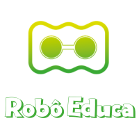
</div>

<hr>

[English Version](/README.md)


<hr>

## 🤓 Aprenda a programar construindo seu próprio robô.

Robô Educa  é uma plataforma inovadora que ensina programação para crianças de 6 a 14 anos, promovendo a inclusão e a sustentabilidade 🤝♻️. A jornada começa com uma história inspiradora de dois irmãos, Suzy e Otávio, que desejam construir um robô 🤖 e contam com a ajuda de seu professor Carlos Sales 👨‍🏫 que os incentiva a montar seu próprio robô humanoide utilizando materiais reciclados, programação e nuvem ♻️💻☁️.

É neste contexto que surge o Web Aplicativo Robô Educa que acessível a partir de qualquer smartphone 📱 se torna o "cérebro" do robô 🧠 interagindo com a criança através de  mensagens de áudio 🗣️ tornando-o acessível inclusive para pessoas com deficiência visual. A montagem do robô e a interação com o aplicativo estimulam a coordenação motora 🖐️ e a criatividade ✨ ensinando a criança conceitos tecnológicos de forma lúdica e inclusiva.

E toda a mágica realizado pelo aplicativo só é possível por conta do uso da **Google GEMINI API** 🤖 que permite ao Robô Educa entender e responder às perguntas da criança, explicar conceitos complexos 🤯 e realizar quizzes gamificados 🎉. Essa tecnologia disponível na nuvem da Google transforma o aprendizado em uma conversa natural e divertida 😄 abrindo novas perspectivas para o futuro destas crianças 🚀.

## 💪 Histórico de Impacto Social

Desde o ano de 2018 este trabalho já impactou centenas de crianças em diversas comunidades carentes na cidade de **Salvador, Bahia - Brasil**.

O idealizador deste projeto, [Carlos Sales](https://drive.google.com/file/d/1KPPJQhNn_YsWYK6qllP6muns6WlSRyM1/view?usp=sharing), é um homem negro de origem periférica graduado em Ciência de Dados e Desenvolvedor de Sistemas. O mesmo conta um pouco da sua história no documentário [C0d3rs Championship](https://www.primevideo.com/detail/0GS98CG03BVM7C224YK7KIWXOJ) disponível no Amazon Prime Video.

Mas foi somente no ano de 2024 com o advento das **IA Generativas** e da **Google GEMINI API**, que o robô passou a ter um **cérebro** capaz de responder de forma inteligente e rápida, tornando a interação muito mais flúida e encantadora 😄!

<div style="display: flex;">

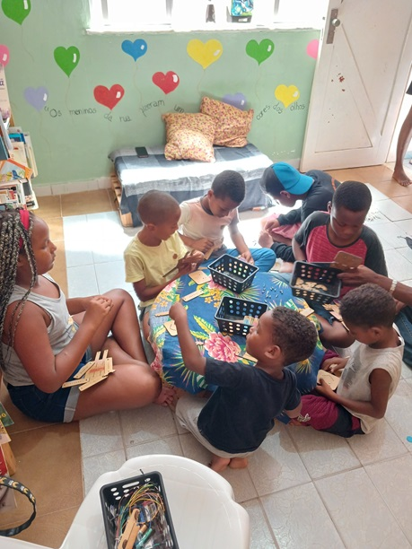
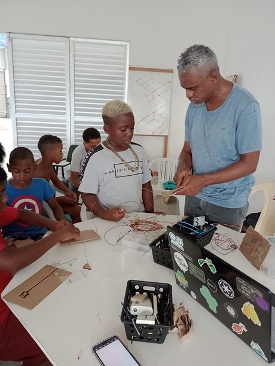
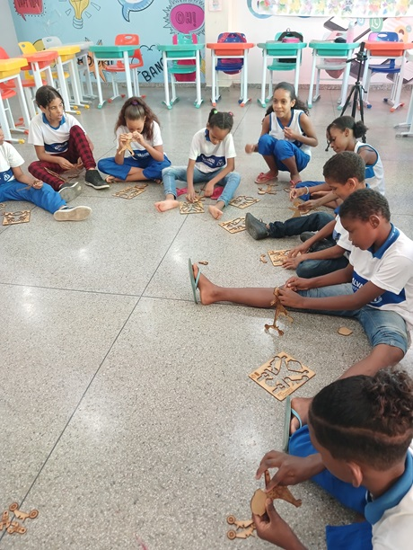
</div>

#### 📸 Visite nossa [galeria de fotos](https://photos.app.goo.gl/yJiewdTTsNFtmF846) para conhecer mais sobre nossas oficinas de inclusão digital.

#### 📢 Assista o [depoimento](https://youtu.be/rjb9G7iBl8Q) de diretores, professores e alunos que já utilizaram nossa plataforma.

## Como as coisas funcionam

### 👤 CORPO

A plataforma **Robô Educa** oferece uma experiência prática e criativa para os alunos, orientando-os na montagem física de um robô humanoide. Este robô pode ser feito com materiais recicláveis como garrafas PET ♻️ ou kits em madeira MDF. Após a montagem física, os alunos dão vida ao robô usando o "cérebro" dele 🧠, que é o aplicativo contido neste repositório.

<div style="display: flex;">
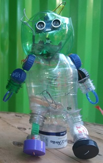
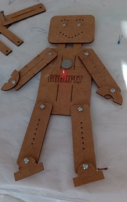

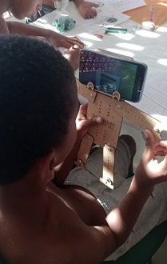
</div>

### 🧠 CÉREBRO

O aplicativo, cérebro do robô, permite que o mesmo desempenhe funções cognitivas como ouvir, pensar e falar. 

#### Tecnologias utilizadas na construção do aplicativo

<div align="center">
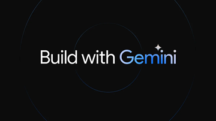
</div>

- 
- 
- 
- 

<hr>

### Arquitetura

A aplicação é desenvolvida utilizando ferramentas open-source. O backend é desenvolvido em Python usando o framework Flask e o FrontEnd é todo feito em HTML e Javascript.

### Arquivos Principais e Funcionalidades


### Backend - `routes.py`
O arquivo `main.py` gerencia todas as rotas disponíveis na aplicação. É aqui que diferentes endpoints são definidos para lidar com as interações dos usuários e o processamento de dados.

```python
# Dependências
from main import app
from flask import render_template, request, session, redirect, url_for, make_response, jsonify

# Página inicial/Index
@app.route('/')
def home():
    return render_template('index.html')

# Troca de mensagens entre usuário e bot
@app.route('/talk', methods=['POST']) 
# Interação com a Google Gemini API
def talk(userMessage):        
    # Inicia interação com Gemini AI
    try:
        convo = model.start_chat(history = [])              # Inicia chat
        convo.send_message(userMessage)                     # envia nova mensagem para ser processada pela IA
        bot_response = convo.last.text                      # Obtem resposta da IA
    except:
        bot_response = "error"

    response = {"status": "success", "message": bot_response}
    return response
```

### Frontend - HTML, CSS e JavaScript


O frontend é implementado utilizando HTML, CSS e JavaScript, focando na simplicidade e facilidade de uso. Ele começa solicitando o acesso ao microfone, que é gerenciado pelo `static/js/mediadevices.js`.

#### Acesso ao Microfone:


Quando o aplicativo é iniciado, ele verifica as permissões para uso do microfone. Se for a primeira vez que o usuário acessa o app, ele será solicitado a conceder a permissão. Este processo é gerenciado pelo arquivo `static/js/mediadevices.js`.

```javascript
async function devices_micPrompt() {
    let permission;
    await navigator.mediaDevices
        .getUserMedia({
            audio: true
        })
        .then(function (stream) {
            permission = "granted"        
        })
        .catch(function (error) {
            if (error.message == "Requested device not found") {
                permission = "notFound";
            } else if (error.message == "Permission denied") {
                permission = "denied";
            } else {
                console.log(error.message)
                permission = 'error';
            }
        });
    return permission;
}
```

#### Interação:
Após o login bem-sucedido, a interação começa no frontend com o arquivo `templates/interaction.html`. A interface visual, gerenciada pelo arquivo `statis/js/display.js`, é simples, com elementos que simbolizam escuta, pensamento e fala.

**Escuta Contínua e Processamento de Fala**:
O robô começa com uma saudação e convida o usuário a participar de um quiz sobre programação. Após falar, o app ativa o microfone em modo contínuo, escutando o que o usuário fala. Essas tarefas são realizadas pelo arquivo `static/js/talk.js`, que utiliza as APIs `Media Devices`, `SpeechRecognition()` e `SpeechSynthesisUtterance()`.

#### 🦻 OUVIR


```javascript
recognition = new SpeechRecognition();
recognition.lang = "pt-BR";
recognition.continuous = true;      // Reconhecimento contínuo em loop
recognition.interimResults = false; // resultados parciais

// Este evento é acionado quando o reconhecimento de voz captura um resultado
recognition.onresult = event => {    
    const transcript = event.results[event.resultIndex][0].transcript;    
    talk(transcript);           // Envia transcrição do audio falado pelo usuário para o backend processar junto à Inteligência Artificial e dar uma respectiva resposta
};

// Verifica se usuário não estiver falando (reproduzindo audio). Após 1 minuto de inatividade, interrrompe reconhecimento e exibe botão de pausa
recognition.onend = () => {
    if (speakStatus == false) {     
        timestampAtual = Date.now();
        var diferenca = timestampAtual - timestampParam;
        var minutosPassados = diferenca / (1000 * 60);
        if (minutosPassados < 1) {
            recognition.start(); // Inicia o reconhecimento de voz
        } else {
            hideAllExceptClose();
            showElement("divPauseStart");
        }
    }        
};
```

#### 🗣️ FALAR


```javascript
// Sintese de Fala - faz o dispositivo reproduzir uma mensagem através de seus autofalantes/fones
function speak(message) {
    message = removerEmojis(message);
    const utterThis = new SpeechSynthesisUtterance(message);
    utterThis.pitch = 2;
    utterThis.rate = 4;

    utterThis.onstart = function () {
        hideAllExceptClose();                   // Oculta elementos que estiverem visiveis na tela
        showElement("divSpinnerWaves");                
    };

    utterThis.onend = function () {        
        speakStatus=false;
        hideAllExceptClose();                   // Oculta elementos que estiverem visiveis na tela
        showElement("divSpinnerRipple");        // Exibe Spinner simulando ondulaçao de escuta 
        recognition.start();                    // Inicia o reconhecimento de voz 
        timestampParam = Date.now();       
    };

    recognition.stop();                         // Ao iniciar a fala (reprodução do audio) Interrompe o reconhecimento de voz
    speakStatus=true;                           // Speaking     on=true  off=false
    synth.speak(utterThis);                     // inicia a reprodução da mensagem    
}

// Remove emojis da mensagem, para que a mesma possa ser reproduzida via sintese de fala
function removerEmojis(texto) {
    return texto
        .replace(/\p{Emoji}/gu, '') // Remove emojis
        .replace(/\s+/g, ' ') // Remove espaços em branco extras
        .trim(); // Remove espaços em branco no início e no fim
}
```

### 🧠 Processamento Cognitivo com a API Google Gemini


#### Rapidez nas respostas utilizando o modelo: **gemini-1.5-flash** 

Quando uma frase completa é detectada, ela é enviada para o backend para processamento cognitivo. Esta tarefa é realizada pela **API do GEMINI**, utilizando o modelo `gemini-1.5-flash` que produz respostas rápidas e precisas, garantindo conversas fluidas que tornam o robô mais **envolvente e realista**.

#### Engenharia de Prompt

Utilizamos a técnica **Zero-Shot Prompting** aliada a um recurso do SDK do GEMINI, as **System instructions**, que fornecem um quadro de referência para o modelo, ajudando-o a compreender a tarefa e a responder de forma adequada sem precisar de exemplos específicos.

```python
import google.generativeai as genai

genai.configure(api_key=my_api_key)

system_instruction = os.environ.get("SYSTEM_INSTRUCTIONS")    # Gemini - Instruções do Sistema / Informa as caracteristicas do Assistente.

model = genai.GenerativeModel(model_name=ai_model,
        generation_config=generation_config,
        system_instruction=system_instruction,
        safety_settings=safety_settings)
```

### Configurando a criatividade das respostas

O parâmetro `generation_config` é utilizado para controlar o comportamento do modelo de linguagem durante a geração de texto. Ele contém várias configurações importantes que influenciam a criatividade, o foco e o tamanho das respostas do modelo. 

Em especial chamamos a atenção para a configuração de **TEMPERATURE'** que controla o grau de aleatoriedade nas respostas. Valores mais altos (próximos a 2) levam a resultados mais criativos e diversificados, mas podem ser menos previsíveis e eventualente podem conter erros/alucinações. Valores mais baixos (próximos a 0) geram respostas mais focadas e conservadoras, porém, tendendo a repetir padrões comuns. 

A configuração `max_output_tokens` define o número máximo de tokens (palavras ou subpalavras) que o modelo pode gerar na resposta. Isso evita respostas excessivamente longas e ajuda a controlar o tempo de processamento.

```python
generation_config = {
  "temperature": 1,
  "top_p": 0.95,
  "top_k": 64,
  "max_output_tokens": 8192  
}
```

### 🛡️ Conteúdo para crianças - Segurança no comportamento do modelo 

A **Google Gemini API** oferece uma funcionalidade chamada `safety_settings` que permite controlar o comportamento do modelo de linguagem em relação à segurança, especialmente em conversas com crianças. Ao instanciar o modelo é possível definir os níveis desejados de proteção contra conteúdo impróprio ou perigoso.

```python
safety_settings = [  
  {
    "category": "HARM_CATEGORY_HARASSMENT",
    "threshold": "BLOCK_LOW_AND_ABOVE"
  },
  {
    "category": "HARM_CATEGORY_HATE_SPEECH",
    "threshold": "BLOCK_LOW_AND_ABOVE"
  },
  {
    "category": "HARM_CATEGORY_SEXUALLY_EXPLICIT",
    "threshold": "BLOCK_LOW_AND_ABOVE"
  },
  {
    "category": "HARM_CATEGORY_DANGEROUS_CONTENT",
    "threshold": "BLOCK_LOW_AND_ABOVE"
  }
]
```

Sendo:

 **category**: A categoria específica de conteúdo prejudicial que você deseja bloquear. As categorias disponíveis são:

* HARM_CATEGORY_HARASSMENT: Bloqueia conteúdo que pode ser considerado bullying, assédio ou perseguição.
* HARM_CATEGORY_HATE_SPEECH: Bloqueia conteúdo que promove o ódio, a violência ou a discriminação contra grupos específicos.
* HARM_CATEGORY_SEXUALLY_EXPLICIT: Bloqueia conteúdo sexualmente explícito ou sugestivo.
* HARM_CATEGORY_DANGEROUS_CONTENT: Bloqueia conteúdo que pode ser considerado perigoso, como instruções para atividades perigosas ou informações sobre como fabricar armas.

E:

**threshold**: O parâmetro que define o nível de rigor com que o modelo deve bloquear conteúdo dentro de uma determinada categoria. O valor selecionado foi:

**BLOCK_LOW_AND_ABOVE**: Bloqueia qualquer conteúdo dentro da categoria que seja considerado "baixo", "médio" ou "alto" em termos de risco. Este é o nível de segurança mais alto e é adequado para ambientes onde a proteção de crianças é priorizada.


### ✅ Conclusão

O Robô Educa combina criatividade física com inteligência artificial de ponta para criar uma experiência interativa e educacional para crianças. A arquitetura modular da plataforma e o uso de tecnologias web modernas a tornam escalável, segura e adaptável a diversos ambientes de aprendizado.

## 💻 Como executar este aplicativo em seu PC Windows

1. Clone o repositório:
```
$ git clone https://github.com/Robo-Educa/robo-educa-gemini-server.git 
```
2. Instale as dependências:
```
$ cd robo-educa-gemini-server
$ pip install -r requirements.txt
```
3. Crie um arquivo .ENV a partir do .ENV.EXAMPLE e preencha os valores das variáveis de ambiente conforme o seu projeto.

4. Execute o projeto:
```
$ python main.py
```
5. Teste no Navegador:
```
http://localhost:5000
```

## 📄 Licença

Este projeto está licenciado sob a [Apache 2.0 License](LICENSE). Observe também os Termos de Serviço.

## 🤝 Contribuições

Contribuições são bem-vindas! Sinta-se à vontade para abrir um pull request ou colaborar de qualquer outra forma.

💪 E você? Gostou? Então faça sua parte e colabore com esta iniciativa para que possamos ampliar ainda mais o nosso impacto.

* Contatos/WhatsApp: +55 (71) 9.9341-6896 
* E-mail: roboeduca.net@gmail.com

<div style="display: flex;">
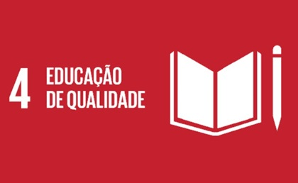
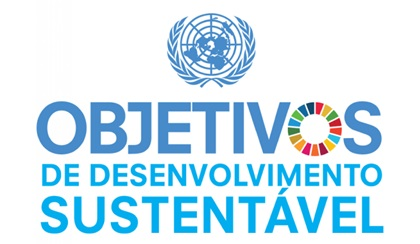
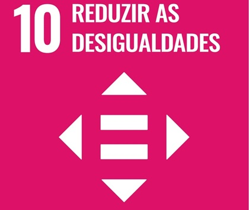
</div>